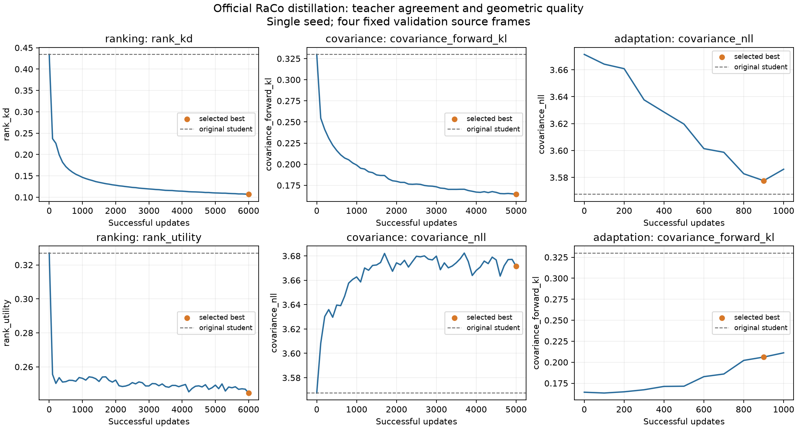

# 公式 RaCo からの順位・共分散蒸留

## 結論と実験範囲

公式 [cvg/RaCo](https://github.com/cvg/RaCo) を凍結教師とし、既存
`XFeatRaCo` の順位・共分散headへ蒸留する経路を追加した。
**今回の単一seed・固定4フレームの実験では、教師への一致は改善したが、
初期モデルより良い幾何性能は得られなかった。既存の学習済みモデルを維持する。**

| 状態 | 更新数 / 選択step | 順位utility ↑ | 共分散 KL(T‖S) ↓ | 幾何NLL ↓ | 95%被覆率 |
|---|---:|---:|---:|---:|---:|
| 初期student | 0 | 0.32697 | 0.32995 | **3.56743** | 92.4227% |
| 順位KD | 6000 / 6000 | 0.24459 | 0.32995 | 3.56743 | 92.4227% |
| 順位KD＋共分散KD | 5000 / 5000 | 0.24459 | **0.16429** | 3.67144 | 91.3964% |
| 上記＋共分散の幾何適応 | 1000 / 900 | 0.24459 | 0.20615 | 3.57762 | 92.4218% |
| 同じstudent候補で教師出力を使用 | 学習なし | **0.33125** | — | 3.67076 | 95.2243% |

順位utilityは、正逆方向とも3pixel以内の幾何相互最近傍のうち、両画像で上位K点に
残った対応数をKで割った値を、K={128,256,512,1024,2048,4096}で平均する。
候補数がK未満でも分母はK。さらに有効なvalフレームを等しく平均する。
記述子matchingの正解率とは別の指標である。
KLはview内で教師confidenceによる加重平均、その後2viewとvalフレームで等しく平均する。
NLLと被覆率は各フレームの8pixel以内の幾何対応上で正逆方向を平均し、最後にフレーム平均する。
今回の全評価では4フレームが有効だった。損失の対数は自然対数である。

共分散の2段階ではrankerを固定しているため、順位utilityは変わらない。
教師の順位を直接使う比較は有用性の診断であり、蒸留性能の厳密な上限ではない。
順位KDの損失は0.43434→0.10662、教師とのtop-512集合一致率は19.31%→49.83%に改善した。
それでも対応点選択は悪化したため、模倣損失だけで採用しない。



同じ集計から表と曲線を再描画する [Jupyter Notebook](../notebooks/raco_distillation.ipynb) もある。
数値・各評価時点・重みSHA256は [集計JSON](raco_distillation_results.json) にある。
学習画像、撮影系列名、個人のパス、再開用optimizer状態は集計JSONに含めていない。

## 1. 教師・生徒と学習位置

| 項目 | 契約 |
|---|---|
| 入力 | RGB `[B,3,H,W]`、FP32、値域 `[0,1]`。実験は640×480 |
| 生徒 | 既存bestのXFeat本体・BN・記述子・候補生成を凍結。対象headだけ更新 |
| 候補C | 既存NMS、検出閾値0.05、border4、上限8192を維持 |
| 教師 | 公式sourceを外部ディレクトリから読み込み、公式重みをstrict load、eval/no_grad |
| 教師信号 | 同じ拡張済みRGBに対する生のrank、検出logit、活性化後Cholesky係数 |
| 学習位置 | 生徒候補点。候補集合の外に新しい点は増やさない |
| 検出部 | 今回は固定。教師の検出信号は共分散損失の重みに使う |

`raco_teacher.py` は公式forwardのhead出力をhookで取得する。
コピーした推論ネットワークや表示用PNGを教師にしない。
公式コード自身のpaddingを除き、Choleskyの正値化・補間順序を維持する。
sourceとweightsのハッシュをrun identityへ記録する。

公式重みSHA256:
`79f0d862bb41abedd8dda33a9b0120f4dcd619c43a90398175bad1a019192e3a`。
使用sourceの3ファイルをまとめたidentity hash:
`6e9ab9c19044b6af70f098e2ff3ce760f01caa9c63c2e00ab704f823d08640c2`。
モデル版を変更するときは、重みとsourceの整合性を改めて確認する。

## 2. 座標と共分散の単位

生徒の整数画素中心を共通座標にする。公式APIが返す座標には内部座標から
`+0.5` が入るため、公式の疎な出力と照合するときは差し引く。
APIの加算・減算によるFP32丸めは最大約`3.05e-5`画素だった。
公式内部の同一座標を用いた診断では、順位・確率・共分散がadapterと完全一致した。
640×480と、paddingが必要な633×475の両方で照合している。

共分散の単位は教師・生徒が実際に入力した格子のpixel²。
教師にはresizeなしの`forward`を使う。提供版の`extract()`は共分散のresize復元に
`A Σ Aᵀ`を使っていたが、元画像への復元には`A⁻¹ Σ A⁻ᵀ`が必要になる。
今回の経路はこのresize処理を呼ばない。生徒の既存座標復元APIは維持する。

教師は活性化済みCholesky係数を補間してから`LLᵀ`を計算する。
共分散行列を先に作ってから補間すると、一般には別の値になる。
両者の同じ位置で比較するため、KLへ平均位置の差は入れない。

## 3. GauChoとの関係と共分散KL

[GauCho §3](https://arxiv.org/html/2502.01565v1) は、角度・幅・高さを経由せず
正定値共分散のCholesky係数を予測する表現を示している。
現行headもこの表現と同族である。GauChoのanchor-free headは対角に`stride × exp`を
使うが、本実装は既存重みと互換なsoftplusを維持する。
物体の広がりを表すOBBのstrideスケールは、特徴点の位置誤差へ追加しない。

生徒の3出力`(a,b,c)`から、

\[
L_S=\begin{pmatrix}\operatorname{softplus}(a)&0\\b&\operatorname{softplus}(c)\end{pmatrix},
\quad\Sigma_S=L_SL_S^T+\sigma_{min}^2I,
\quad\sigma_{min}=0.05\;\mathrm{pixel}.
\]

教師にも同じ`0.05² I`を加えた行列をKD対象とする。
中心が等しい2次元ガウスの標準KLを使う。

\[
D_{T\to S}=\frac12\left[
\operatorname{tr}(\Sigma_S^{-1}\Sigma_T)-2+
\log\det\Sigma_S-\log\det\Sigma_T\right].
\]

これは [KLD論文のEq.9](https://arxiv.org/html/2106.01883v5) の平均差を0にした形。
同じ固有値で方向だけが違う場合は
`0.5*(κ+1/κ-2)*sin²(Δθ)`となる。等方分布では方向差に罰則を与えず、異方性が強いほど
方向差を重く扱う。各行列をdetやtraceで個別に正規化せず、絶対的な画素スケールも移す。

両分布に同じ可逆変換を施すとKLは不変だが、追加したfloorも同じ行列変換を受ける必要がある。
変換後に固定のisotropic floorを加え直す処理とは同じではない。

### テンソル実装

行列shapeは`[...,2,2]`。leading dimensionsはbroadcastできる。
実装は`xfeat_training/raco_distillation.py`の`gaussian_kl(source, destination)`。

```python
# Mathematical core; actual helper also checks finite/SPD/roundoff conditions.
LT = torch.linalg.cholesky(teacher_covariance)
LS = torch.linalg.cholesky(student_covariance)
A = torch.linalg.solve_triangular(LS, LT, upper=False)
log_ratio = 2 * (
    LS.diagonal(dim1=-2, dim2=-1).log().sum(-1)
    - LT.diagonal(dim1=-2, dim2=-1).log().sum(-1)
)
kl = 0.5 * (A.square().sum((-2, -1)) - 2 + log_ratio)
```

点ごとのPython loop、明示的な逆行列、行列式の直接除算は不要。
FP32以上で計算する。SPD違反・非有限値・`-1e-5`未満のKLは明示的に失敗し、
その範囲内の微小な負値だけを0にする。教師はdetachする。
数値診断では3×5のbroadcast結果が`torch.distributions`のKLと一致し、有限な勾配も確認した。

候補上の損失は教師検出logit `dT`を用いて
`w=softmax(dT over C)`、`LcovKD=sum(w*KL)`。
大きな共分散を閾値で除外せず、生徒が重みを下げて逃げる経路も作らない。
ただしconfidence weightingは仮説である。今回の有効標本数`1/sum(w²)`は、
各viewの候補3092～5288点に対して225～467点だった。重みの集中は今後の対照実験対象になる。

### KLの方向・変換を曖昧にしない

| 設定 | 定義 |
|---|---|
| `teacher_to_student` | 標準の`D(T‖S)`、今回の基準 |
| `student_to_teacher` | `D(S‖T)` |
| `symmetric` | 両方向の算術平均。Jensen–Shannonではない |
| `mse` | 共分散4要素の二乗誤差平均、単位pixel⁴ |
| `identity` | 生の距離、今回の基準 |
| `log1p` | `log(1+D)` |
| `bounded_log1p` | `1-1/(1+log(1+D))` |

平方根は使用しない。MSEはidentityとの組み合わせだけを許す。
方向・変換を変更しても、評価には生の`D(T‖S)`を別途残す。
これらの対照設定は実装したが、今回の学習比較はforward KLと後段適応だけ。

MMRotateの [gaussian_dist_loss.py](https://github.com/open-mmlab/mmrotate/blob/main/mmrotate/models/losses/gaussian_dist_loss.py)
はpred=Sなら変換前に`D(T‖S)`を計算する。
[gaussian_dist_loss_v1.py](https://github.com/open-mmlab/mmrotate/blob/main/mmrotate/models/losses/gaussian_dist_loss_v1.py)
は`2D(S‖T)`で、同名でも同条件ではない。非線形変換の内側の係数差は、外側のloss weightでは一般に相殺できない。
MMRotate自体は依存に追加していない。

## 4. 順位の蒸留

教師の生スコアと、生徒の`(-3,3)`に制約された最終順位をL2回帰しない。
[RankNet](https://www.microsoft.com/en-us/research/publication/learning-to-rank-using-gradient-descent/)
型のペア比較を蒸留に使う。

候補集合内で教師を平均0・分散1に正規化する（分散floor `1e-6`）。
`qij=sigmoid(ti-tj)`、`pij=sigmoid(rSi-rSj)`、温度1で、
`KL(Bernoulli(qij) ‖ Bernoulli(pij))`を`2*abs(qij-0.5)`で加重平均する。
生徒は補正項deltaではなく、推論時に使用する**最終順位スコア**を学習する。
教師同点と自己ペアの重みは0。全重みが0なら損失も0になる。

1viewあたり4096比較。半分を全候補から、半分を教師順位512位の前後128点から一様抽出する。
候補が512以下なら中央を境界にする。全候補の二乗個のペアは作らない。
評価の抽出乱数は固定する。継承configの`temperature_start/end`は既存幾何順位損失用で、
このKDの温度を変更するものではない。

## 5. 生徒の誤差への適応

教師の共分散は教師の検出位置に対する信号であり、XFeatの整数画素検出誤差と等しいとは限らない。
純粋KDの後で、既存`covariance_nll()`を追加する。

\[
e=x_B-H(x_A),\quad S_e=\Sigma_B+J_H\Sigma_AJ_H^T,
\quad L_{geom}=\frac12(e^TS_e^{-1}e+\log\det S_e+2\log(2\pi)).
\]

実装は正逆方向の平均。観測誤差の独立性と局所一次近似を仮定する。
対応は既存の幾何相互最近傍・有効領域・8pixel閾値に固定し、4/8/12pixel診断も残す。
2次元chi-squareの被覆率閾値は`-2*log(1-p)`、p=0.5/0.9/0.95。
残差閾値で選別された対応の被覆率なので、無条件の校正率とは呼ばない。

`L = λKD*LcovKD + λgeom*Lgeom`。
完了済み更新数をuとして、次の更新には
`a=min(u/1000,1)`、`λKD=1-0.9a`、`λgeom=a`を使う。
共分散以外のheadとbackboneは固定。
共分散を使わないmatcherでは、この更新だけで対応点数は増えない。

今回の適応は1000更新時のheuristicで停止した。最良NLLは900更新であり、
ramp後の定常的な学習を長時間評価した結果ではない。
同じ追加更新予算の幾何NLL単独controlも実施していないため、KD固有の効果を主張しない。

## 6. 実行方法と保持規則

uvのtrain/eval依存を使用する。公式source rootには`raco/__init__.py`、
`raco/raco.py`、`raco/utils.py`が必要。公式重みは
[v1.0.0 release](https://github.com/cvg/RaCo/releases/tag/v1.0.0) の`raco.pth`。
source/weightsと学習データは利用者が用意し、Gitへ追加しない。

次の環境変数を入力に対応するpathへ設定してから、リポジトリrootで実行する。
`PAIRS_DIR`は既存のtrain/val/test NPZとmanifestを含むディレクトリ、
`XFEAT_WEIGHTS`は初期bundleと同一backboneの重み、`STUDENT_BUNDLE`は既存best。
`RACO_SOURCE`と`RACO_WEIGHTS`は公式source rootと重みfileを指す。

```bash
rtk uv run --no-sync python -m xfeat_training.raco_distill_train \
  "pairs_dir=$PAIRS_DIR" "xfeat_weights=$XFEAT_WEIGHTS" \
  "init_bundle=$STUDENT_BUNDLE" "distillation.teacher_source=$RACO_SOURCE" \
  "distillation.teacher_weights=$RACO_WEIGHTS" \
  run_dir=runs/kd_rank task=raco_rank max_steps=50000

rtk uv run --no-sync python -m xfeat_training.raco_distill_train \
  "pairs_dir=$PAIRS_DIR" "xfeat_weights=$XFEAT_WEIGHTS" \
  init_bundle=runs/kd_rank/exports/best_raco.pt \
  "distillation.teacher_source=$RACO_SOURCE" "distillation.teacher_weights=$RACO_WEIGHTS" \
  run_dir=runs/kd_cov task=raco_covariance max_steps=20000

rtk uv run --no-sync python -m xfeat_training.raco_distill_train \
  "pairs_dir=$PAIRS_DIR" "xfeat_weights=$XFEAT_WEIGHTS" \
  init_bundle=runs/kd_cov/exports/best_raco.pt \
  "distillation.teacher_source=$RACO_SOURCE" "distillation.teacher_weights=$RACO_WEIGHTS" \
  run_dir=runs/kd_adapt task=raco_covariance max_steps=20000 \
  distillation.geometry.enabled=true
```

設定は [raco_distill.yaml](../configs/raco_distill.yaml)。batch1、FP32、AdamW lr`2e-4`、
weight decay`1e-4`、grad clip1、seed20260928。100更新ごとに固定valを評価する。
LRはmax_steps全体のcosine schedule。合成viewは既存train pairの第1RGBから生成する。
RGB-Dデータの深度・実カメラ姿勢を今回のKD教師として使うわけではない。

1000更新ごとに直前3評価とその前3評価を比較し、平均改善とbest改善の両方が
`max(1e-4, abs(前窓平均)*0.01)`以下なら停止する。固定val上のheuristicであり、収束証明ではない。
選定はrank KD、covariance KD、適応のgeometry NLLをそれぞれ最小化する。
**各runでval上位3checkpoint＋最新の再開用1件**を保持し、重複は1件として扱う。
`exports/best_raco.pt`は選択された推論bundle、`last_raco.pt`は最後のbundle。

smokeには別run_dirを使い、`pair_split=smoke max_steps=3 eval_every=3 save_every=3 auto_stop.enabled=false`を指定する。
本学習はsmoke重みから開始しない。既存runを上書きせず、resumeは新しいrun_dirと
`resume_from`を指定する。config・runtime source・teacher identityの整合性が必要。

## 7. 診断結果と次の比較候補

全候補での絶対log固有値比誤差は0.5284→0.3769（純KL）→0.4523（適応）。
異方性の形は教師に近づいた。長軸角は教師と生徒の固有値比がともに2以上の点だけを測った。
対象数が198/6740/2633と変わるため、各モデルの角度平均を直接比較しない。
全モデル共通の適格点は30点だけで、角度診断から広い性能結論は出せない。

更新時間の平均（評価stepを除く）は順位約180ms、共分散KL約175ms、適応約478ms。
PyTorchの観測peak allocatedは約1.55/1.58/2.14GiB。
初期化・予約メモリ・GPU全体消費を含む値ではなく、推論FPSの比較でもない。

次に検討するなら、confidenceの一様/混合重み、順位の元の幾何目的との併用、
適応ramp後の追加学習、同予算のgeometry-only controlを個別に比較する。
候補点外への補助supervisionや検出部の蒸留は今回未実施。
検出部を学習する場合は65クラスのセル内分布と教師の画像全体softmaxを変換し、
凍結された学習経路・候補閾値・記述子保持も別途設計する必要がある。

今回実行したのは公式出力との数値照合、解析式/勾配診断、smoke、3段階の実学習と固定val比較。
独立test split、姿勢推定器、未知系列、複数seedの評価とテストスイート実行は行っていない。
